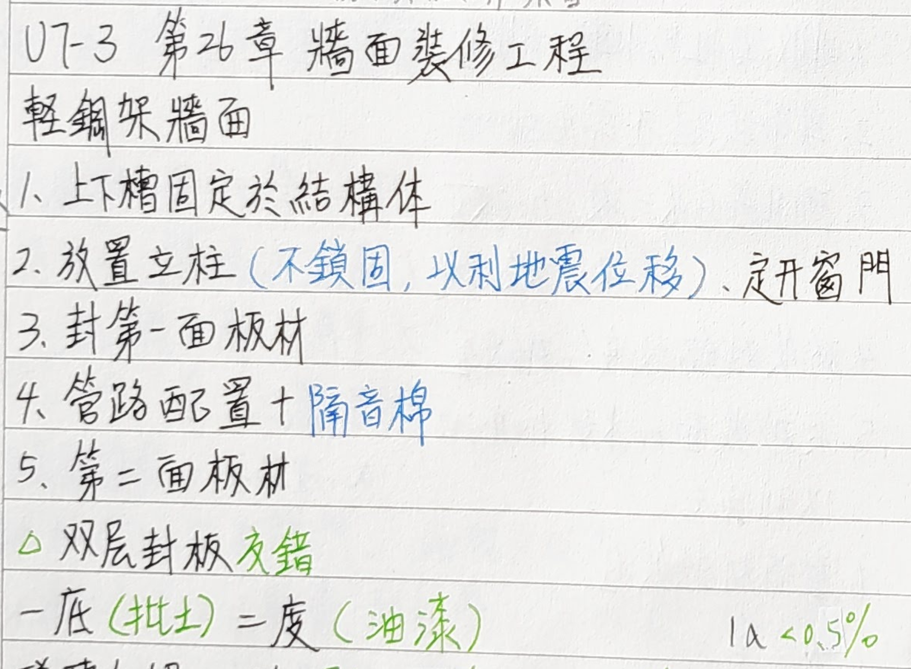

- Tag: #構造
	- 可以使用10 % 飛灰
	- 水膠比<0.4 坍度 10-15cm
	- Low-e 玻璃
		- 低輻射（加上鐵、鈷）
		- 無機固態薄膜
		- 改善可見光、日光
	- 強化玻璃
		- 耐壓衝擊3-5倍
		- 不可切割
		- 耐溫差250度
	- 屋頂：
		- 不鏽鋼外用焦油、瀝青、永久隔離材
		- 開口填縫
	- 隔熱層在下框內，面朝向室內
		- {:height 397, :width 658}
	- Glass 厚度與隔音相關（5+3 or 4+4...)
	- 浴室防水：
		- 自地坪高 >1.8m 做防水
		- 24hr 室水
	- 防水工法：
		- 聚氨脂系塗膜 一體成型、密
		- 常溫自黏式防水氈 （精度要求較高）
		- 壓克力（丙烯酸脂）橡膠系塗膜（抗紫外線耐久）
		- 瀝青防水：
			- a.油毛氈重合>9m，表面用砂粒油毛氈
			- b.不做步行用
	- 帷幕牆系統：
		- 
	- 填縫材：
		- 非收縮性防水較油質類型佳
		- 導帶填縫則不需要底油
		- 硫化聚合系二液：加硬化，單液：大氣硬化
		- 矽質對鋁較接合對鋼差
		- 於砂漿面或木材加底油以利接合
		- 墊背材軟質佳
	- 玻璃磚：
		- 水平接縫每60公分一個鉚定板
		- 殺漿在塑性狀態整平
	- 耐燃材料：
		- 
	- 防火門：
		- 
	- 門窗工程：
		- 玻璃至少深入鋁框>6mm
		- 
	- 地板裝修工程
		- 
		- 
		- {:height 299, :width 716}
		- 木作地板
			- {:height 255, :width 685}
			  id:: 6339631c-b7d1-41f0-860d-017dde8dfc83
			- 
			- 
		- 陶
			- 吸水：<50%
			- 石頭：<10%
			- 磁磚：<3%
		- 吸音牆
			- 高頻：薄玻璃棉、窗簾、甘蔗版
			- 低音：RC, 空心磚塊,空氣層,夾板（震動）
			- 低～高頻：厚玻璃棉,多層窗簾（越厚，低音吸越多）
		- 天花板裝修工程
			- 
		- 綠建材使用率
			- 室內60室外20
		- 電扶梯
			- 視同挑空
		- 工地安全管理
			- 電梯開口：
				- a欄杆或閘門
				- b 上中欄杆開口<55cm（有金屬網可以不設）
				- c 欄杆高90公分
			- 淹水優先處理：防止地下室上浮
			- 未達查核＄，可減施工計畫，但仍需要施工作業管理、進度管理、勞安衛
			- 限期完工：不論開工日均限某日完工
			- 營造安全衛生設施標準
				- 
			- 危險工作場所
				- 
			- 綠屋頂
				- 上到下：植栽->介質->過濾->排水->阻根->防水隔熱->deck
			- 安全母鎖
				- 鋼索、尼龍、合成纖維、min斷裂強2300kg
				- 高度>ˇ3.8m(至可墜落地面高度)
				- only一人使用兼具1m可以兩人
			- S曲線圖
				-
-